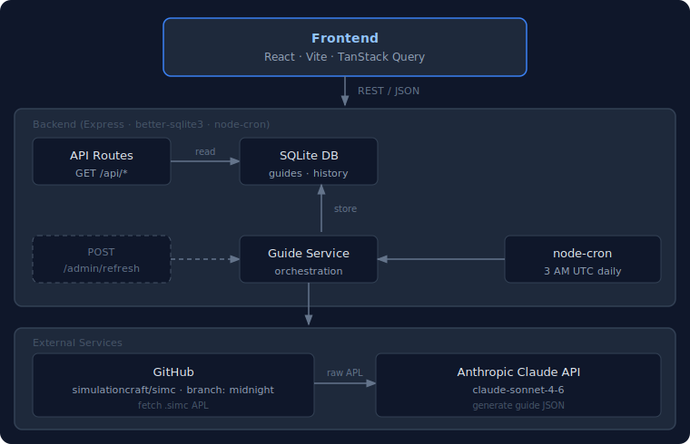

# SimC Rotation Guides

> **Live App:** [https://simc-rotation.app](https://simc-rotation.app)

AI-powered World of Warcraft rotation guides generated directly from [SimulationCraft](https://github.com/simulationcraft/simc) Action Priority Lists (APLs). Each guide is built by feeding the raw `.simc` APL file into Claude, producing a structured, human-readable rotation guide that stays automatically synchronized with the SimC `midnight` branch.

## Overview

SimC APLs are the authoritative source for optimal rotation logic, but they are written in a domain-specific scripting language that is difficult to read. This app translates those APLs into clear, prioritized rotation guides using Claude.

Every spec across all 13 classes is tracked. When SimC's APL changes (detected via commit SHA), the guide is automatically regenerated. Historical versions are preserved so you can see how a rotation evolved over patches.

## Features

- **44 WoW specs** across all 13 classes
- **AI-generated guides** from live SimC APLs using `claude-sonnet-4-6`
- **Auto-sync** - daily cron detects APL changes via GitHub commit SHA and regenerates only what changed
- **Guide history** - every generated version is archived with its APL commit SHA, generation date, and model used
- **Changelog tracking** - automatic diff detection between guide versions highlights what changed
- **Ask AI** - Q&A chatbot lets you ask questions about any spec's rotation (requires QA API key)
- **Complexity rankings** - specs ranked by APL action count for single-target and AoE
- **Dark mode** - full dark/light theme toggle with persistent preference
- **Responsive UI** with class-colored sidebar, role badges, and priority list rendering

## Architecture



## Getting Started

### Prerequisites

- **Node.js** 20+
- **npm** 10+
- **Anthropic API key** - [console.anthropic.com](https://console.anthropic.com)
- *(Optional)* GitHub personal access token for higher API rate limits

### Environment Variables

Copy `.env.example` to `.env` in the project root:

```bash
cp .env.example .env
```

| Variable | Required | Default | Description |
|---|---|---|---|
| `ANTHROPIC_API_KEY` | Yes | -- | Anthropic API key for Claude |
| `ADMIN_SECRET` | Production | Auto-generated in dev | Bearer token for admin endpoints |
| `PORT` | No | `3001` | Backend HTTP port |
| `DB_PATH` | No | `./data/db.sqlite` | Path to SQLite database file |
| `ANTHROPIC_MODEL` | No | `claude-sonnet-4-6` | Claude model to use |
| `PROMPT_VERSION` | No | `1.0.0` | Logged alongside generated guides |
| `GITHUB_TOKEN` | No | -- | GitHub PAT (avoids 60 req/hr rate limit) |
| `CRON_SCHEDULE` | No | `0 3 * * *` | Cron schedule (default: 3 AM UTC daily) |
| `CORS_ORIGIN` | No | `http://localhost:5173` | Allowed CORS origin |
| `VITE_API_BASE_URL` | Frontend | `/api` | Full backend URL for Vercel deployment |

Additional optional configuration (see `.env.example` for full list):

| Variable | Default | Description |
|---|---|---|
| `RATE_LIMIT_GENERAL` | `120` | Requests per minute for public API |
| `RATE_LIMIT_ADMIN` | `10` | Requests per minute for admin endpoints |
| `RATE_LIMIT_QA` | `5` | Requests per minute for Q&A endpoints |
| `QA_MAX_LENGTH` | `1000` | Max character length for Q&A questions |
| `CHANGELOG_CACHE_TTL_MS` | `3600000` | Changelog cache TTL (default 1 hour) |
| `SIMC_REPO` | `simulationcraft/simc` | SimulationCraft GitHub repository |
| `SIMC_BRANCH` | `midnight` | SimC branch to track |
| `SIMC_APL_PATH` | `ActionPriorityLists/default` | APL directory within the SimC repo |
| `PROJECT_REPO` | `Brandon82/SimCRotationGuides` | This project's GitHub repo (for changelog) |

### Local Development

```bash
# 1. Install all workspace dependencies
npm install

# 2. Seed the database with sample data (instant, no API calls)
npm run seed:sample

# 3. Start the backend (http://localhost:3001)
npm run dev:backend

# 4. Start the frontend (http://localhost:5173)
npm run dev:frontend
```

The sample seed loads pre-generated guides for all 44 specs and creates a dev QA API key (printed to the console) for testing the Ask AI feature. No Anthropic API key is required.

> **Full seed (optional):** To generate fresh guides from the live SimC APLs using your own API key, run `npm run seed --workspace packages/backend` instead. Estimated cost is $1-5 depending on APL length and model pricing.

### Docker Deployment

```bash
docker-compose up
```

- Backend: `http://localhost:3001`
- Frontend: `http://localhost:5173`
- Database persisted in a Docker volume at `/app/data`

## API Endpoints

### Public

| Method | Path | Description |
|---|---|---|
| `GET` | `/api/health` | Health check |
| `GET` | `/api/specs` | All classes and specs with `hasGuide` flag |
| `GET` | `/api/guides` | All guides (metadata only) |
| `GET` | `/api/guides/:specName` | Current guide for a spec |
| `GET` | `/api/guides/:specName/history` | Historical guide list |
| `GET` | `/api/guides/:specName/history/:id` | A specific historical guide |
| `GET` | `/api/rankings` | Specs ranked by APL action count |

### Q&A (requires `X-QA-Key` header)

| Method | Path | Description |
|---|---|---|
| `GET` | `/api/qa/validate` | Validate a QA API key |
| `POST` | `/api/qa/ask` | Ask a question about a spec's rotation |

**`POST /api/qa/ask` body:**

```jsonc
{ "specName": "warrior_arms", "question": "When should I use Mortal Strike?" }
```

### Admin (requires `Authorization: Bearer <ADMIN_SECRET>` header)

| Method | Path | Description |
|---|---|---|
| `POST` | `/api/admin/refresh` | Trigger guide generation |
| `DELETE` | `/api/admin/guides/history` | Delete old (non-current) guide versions |
| `POST` | `/api/admin/backfill-changelog` | Generate changelogs for past guides |
| `DELETE` | `/api/admin/changelogs` | Clear all changelogs |
| `POST` | `/api/admin/qa-keys` | Create a QA API key |
| `GET` | `/api/admin/qa-keys` | List all QA API keys |
| `DELETE` | `/api/admin/qa-keys/:id` | Deactivate a QA API key |

**`POST /api/admin/refresh` body:**

```jsonc
{ "spec": "warrior_arms" }                    // Single spec
{ "class": "warrior" }                        // All specs in a class
{ "spec": ["warrior_arms", "warrior_fury"] }  // Multiple specs
{ "spec": "all" }                             // All 44 specs
{ "spec": "warrior_arms", "force": true }     // Skip SHA check
```

**`DELETE /api/admin/guides/history` body:**

```jsonc
{}                                            // All specs
{ "spec": "warrior_arms" }                    // One spec only
```

**`POST /api/admin/backfill-changelog` body:**

```jsonc
{ "spec": "warrior_arms" }                    // Single spec, current guide only
{ "spec": "warrior_arms", "mode": "all" }     // Single spec, all history
{ "spec": "all" }                             // All specs (runs in background)
```

**`POST /api/admin/qa-keys` body:**

```jsonc
{ "label": "Brandon" }                        // Returns { id, apiKey, label }
```

### Rate Limiting

Defaults (configurable via env vars):

| Tier | Limit | Endpoints |
|---|---|---|
| General | 120 req/min | specs, guides, rankings |
| Admin | 10 req/min | all `/api/admin/*` routes |
| Q&A | 5 req/min | all `/api/qa/*` routes |

## Frontend Routes

| Path | Page |
|---|---|
| `/` | Home - class selector and spec grid |
| `/guide/:specName` | Spec guide with changelog and version history |
| `/rankings` | Specs ranked by APL action count (ST and AoE) |
| `/history` | Filterable table of all generated guides |
| `/ask-ai` | Q&A chatbot for asking about spec rotations |

## Adding / Modifying Specs

All spec definitions live in [packages/backend/src/data/specs.ts](packages/backend/src/data/specs.ts). Each entry defines a class with its specs, role, and Blizzard class color. An optional `aplName` field overrides the default `<class>_<spec>.simc` filename if the SimC file doesn't follow that convention.

After adding a new spec, trigger its first guide generation via the admin API.

## Prompt Engineering

LLM prompts live in `packages/backend/src/prompts/`:

| File | Purpose |
|---|---|
| `guidePrompt.ts` | Main APL-to-guide generation. Instructs Claude to translate SimC conditions into plain English and output structured JSON with sections: `overview`, `talent_notes`, `precombat`, `single_target`, `aoe`, `items_and_racials` |
| `qaPrompt.ts` | Q&A answering. Provides the guide content and raw APL as context for answering user questions about rotations |
| `changelogPrompt.ts` | Changelog generation. Compares old and new guide versions and outputs bullet-point descriptions of what changed |

The `PROMPT_VERSION` env var is stored alongside each guide for traceability when the prompt is updated.

## Scripts

Helper scripts live in the `scripts/` directory:

| Script | Description |
|---|---|
| `dev.sh` | Starts both backend and frontend dev servers in parallel (kills both on Ctrl+C) |
| `dev-backend.sh` | Starts the backend dev server only |
| `dev-frontend.sh` | Starts the frontend dev server only |
| `admin_api_helper.sh` | Interactive admin CLI for managing the deployed backend (see below) |

### Admin API Helper

`scripts/admin_api_helper.sh` is an interactive Bash script for managing the deployed backend without crafting raw `curl` commands. It prompts for your Railway URL and admin secret, then presents a menu:

| Action | Description |
|---|---|
| Refresh guides | Regenerate one spec, multiple specs, an entire class, or all 44 specs (with optional force flag to skip SHA check) |
| Delete old guides | Purge non-current historical guide versions for one or all specs |
| Backfill changelogs | Generate changelogs for existing guides that are missing them |
| Delete all changelogs | Clear every changelog entry |
| Create a QA key | Issue a new API key for the Ask AI feature |
| List QA keys | Show all active QA keys |
| Revoke a QA key | Deactivate a specific QA key by ID |

```bash
bash scripts/admin_api_helper.sh
```
